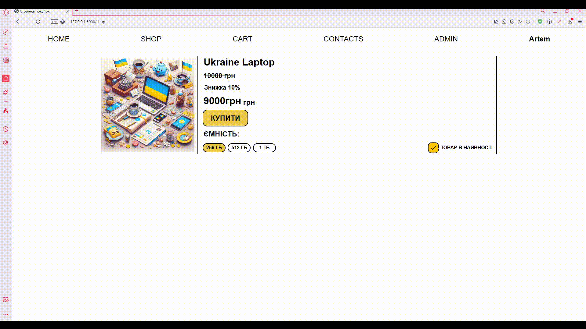
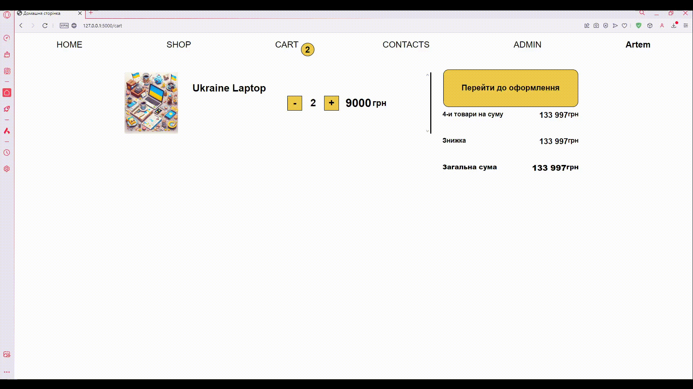
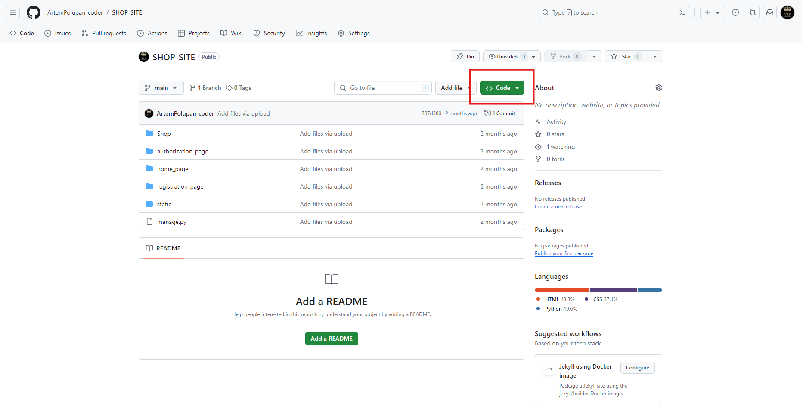
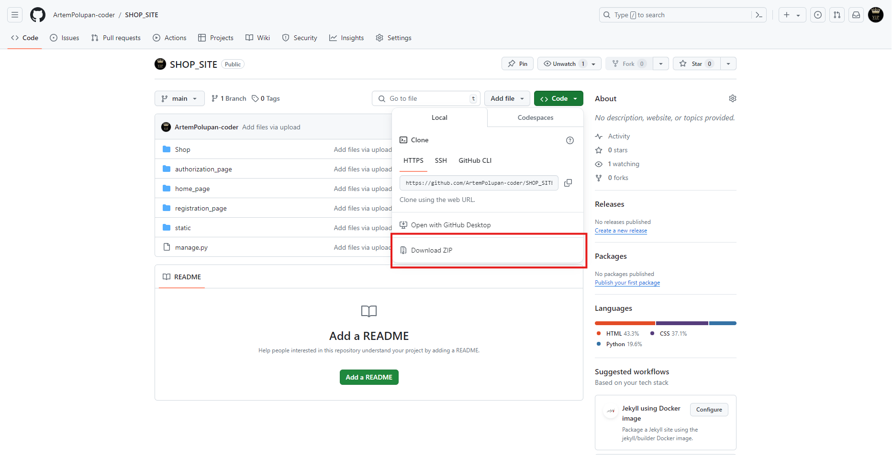

# Онлайн Магазин

***
#### Розробники проекту:
- Артем Полупан/Artem Polupan (https://github.com/ArtemPolupan-coder)
- Назар Зозуля/Nazar Zozulya (https://github.com/Nazar-Zozulya)
- Архип Гончар/Archip Gonchar (https://github.com/Arhip-ops)
***
Цей проект є **повноцінним** онлайн-магазином/This project is a **full** online store
З функціями/With features:
- додавання/зміннення/видалення товару, через адмін-панель/adding/modifying/deleting goods through the admin panel

- додавання товару в кошик/adding a product to the cart

- оформлення замовлення/order placement 

- надсилання замовлення на пошту замовника/sending the order to the customer's mail

  
🤖 Також тут є телеграм бот-менеджер. За допомогою якого можна: з легкістю давати або забирати права адміністратора; додавати/видаляти товар; отримувати всю інформацію про всі товари, замовлення та користувачів; ну і звісно відмічати замовлення як виконане/There is also a Telegram bot manager. With the help of which you can: easily give or take away administrator rights; add/remove products; get all the information about all products, orders and users; and, of course, mark the order as completed  


Данний проект має всі необхідні функції для того щоб зробити пофноцінний веб сайт для замовника/This project has all the necessary functions to make a valuable website for the customer
***
# Технології ⚙️
- Flask - основа/foundation
- JavaScript - фронтенд/frontend
- Html + CSS - стилі та верстка/styles and layout
- Telebot - телеграм бот/telegram bot
- Jinja - Шаблони та спадкування/Templates and inheritance
- SQLite3 - Бази даних та їх моделі/Databases and their models 
***

Для того щоб протестувати цей проект є 3 способи/There are 3 ways to test this project:
>Адмін акаунт на сайті/Admin account on the site
username: Admin
email: admin@gmail.com
password: admin
1. **Перейти на сайт за посиланням/Go to the site at the link https://shopiing.pythonanywhere.com**
2. **Запустити локально, для цього/Run locally, to do this:**
- Перейдіть за наступним посиланням в репозиторій/Follow the following link to the repository [https://github.com/ArtemPolupan-coder/ONLINE_SHOP.git]
  > Якщо ви вже тут попередній крок не виконуємо/If you are already here, do not perform the previous step
- Натисніть на зелену кнопку "Code"/Click on the green "Code" button
- Натисніть на зелену кнопку "Code"

- Далі у вікні яке відкрилося натисніть "Download ZIP"/Next, in the window that opens, click "Download ZIP"

- Після чого збережіть та розпакуйте архів/Then save and unzip the archive 
- Встановіть пайтон за наступним посиланням/Install the python at the following link [https://www.python.org/downloads/]
  > Якщо у вас встановлений пайтон попередній крок ви пропускаєте/If you have Python installed, skip the previous step
- Встановіть VSCode за настпним посиланням/Install VSCode from the following link [https://code.visualstudio.com/download]
  > Якщо у вас встановлений VSCode попередній крок ви пропускаєте/If you have VSCode installed, you skip the previous step
- Після чого відкрийте папку в VSCode/Then open the folder in VSCode 
- Далі натисніть в верхньому лівому куті "Termainal" "New Termanal"/Then click in the upper left corner of "Terminal" "New Terminal"
- І встановіть всі модулі написавши/And install all the modules by writing `pip install flask flask_sqlalchemy flask_migrate flask_mail flask_login telebot`
- Після чого запустіть файл `manage.py`, та перейдіть за посиланням яке з'явилося в терміналі/Then run the file `manage.py`, and follow the link that appears in the terminal
1. **Запуск віддалено (на PythonAnywhere)/Run remotely (on PythonAnywhere)**
- Перейдіть за посиланням [https://www.pythonanywhere.com] та зареєструйтесь/авторизуйтесь, натиснувши відповідну кнопку в верхньому правому куті/Follow the link [https://www.pythonanywhere.com] and register/log in by clicking the appropriate button in the upper right corner
- Створіть нову консоль "Bash"/Create a new "Bash" console

- В ній пропишіть/In it, write down `git clone https://github.com/ArtemPolupan-coder/ONLINE_SHOP.git`
- Next mkvirtualenv [назва віртуального оточення] --python=python3.10
- Далі встановлюємо модулі написавши/Next, install the modules by writing `pip install flask flask_sqlalchemy flask_migrate flask_mail flask_login telebot`
- Дублюємо вкладку з консолюю та в одній з них виходимо на головну сторінку, після чого натискаємо в правому верхньому куті "Files"/Duplicate the tab with the console and in one of them go to the main page, then click "Files" in the upper right corner

- Там шукаємо файл `Online_Shop/Shop/data.db`, та видаляємо його/There we look for the file `Online_Shop/Shop/data.db`, and delete it
- Потім шукаємо папку `Online_Shop/Shop/migrations`, і також видаляємо/Then we look for the folder `Online_Shop/Shop/migrations`, and also delete
- Повертаємося на вкладку з консоллю та пишемо `cd Shop`/Return to the tab with the console and write `cd Shop`.
- Далі по черзі/Next in order `flask --app settings db init`, `flask --app settings db migrate`, `flask --app settings db upgrade`
- Потім знову переходимо на головну сторінку та обираємо в верхньому правому куті "Web"/Then go back to the main page and select "Web" in the upper right corner
- Після чого задаємо шлях "Working dirictory" та "Virtualenv"/Then set the path "Working directory" and "Virtualenv"

- Потім натискаємо на WSGI configuration file/Then click on the WSGI configuration file
 
- І в цьому файлі на 16 рядку пишемо `from Shop import shop_app as application`, і натискаємо "Save"/And in this file, on line 16, write `from Shop import shop_app as application`, and click "Save"
 
І тепер якщо ми перейдемо назад до Web і натиснемо на цей синій напис на перекине на наш сайт/And now, if we go back to the Web and click on this blue label, it will take us to our site

***
# Структура
 
`admin_app` -- адмін-панель сайту/site admin panel
`autorization_page` -- відповідає за авторизацію користувача/is responsible for user authorization
`bot_app` -- відповідає за бота-манеджера/is responsible for the bot manager
`cart_page` -- кошик та взаємодія з ним/shopping cart and interaction with it
`home_page` -- домашня сторінка/home page
`registration_page` -- відповідає за реєстрацію користувача/is responsible for user registration
`Shop` -- головний додаток проекту який надсилає емейл, створює базу данних, та реєструє усі нші додатки/the main project application that sends emails, creates a database, and registers all other applications
`shop_page` -- сторінка покупок/shopping page
***
## Створення головного додатку/Creating the main application
 
```
try:
    # імпорт необхідних бібліотек
    import flask
    import os
    import flask_sqlalchemy
    import flask_migrate

    # створення головного додатку
    shop_app = flask.Flask(
        import_name = "Shop",
        template_folder = "templates",
        static_folder = "static",
        instance_path = os.path.abspath(__file__ + "/.."),
        static_url_path = "/shop_app/"
    )

    # конфігурація бази даних
    shop_app.config["SQLALCHEMY_DATABASE_URI"] = "sqlite:///data.db" 

    # ініціалізація бази даних
    DATABASE = flask_sqlalchemy.SQLAlchemy(app = shop_app)
    # ініціалізація міграцій
    MIGRATE = flask_migrate.Migrate(app = shop_app, db = DATABASE)
except Exception as error:
    print(error)
```

> За допомогою класу Flask створюється новий головний додаток(проект), а також за допомогою додаткових модулів відбувається ініціалізація міграцій з базою даних/Using the Flask class, a new main application (project) is created, and with the help of additional modules, migrations with the database are initialized

## Створення інших додатків/Create other applications 
 
```
try:
    import flask

    admin = flask.Blueprint(
        name = "admin",
        import_name = "admin_app",
        template_folder = "templates",
        static_folder = "static",
        static_url_path = "/admin/"
    )
except Exception as error:
    print(error)
```
> Тут відбувається щось схоже тільки за допомогою класу Blueprint, та не "головний додаток", а звичайний/Here, something similar happens only with the Blueprint class, and not the "main application", but a regular one

## Реєстрування сторінок/Registering pages
 

> Тут ми створюмо нове посилання для нашої сторінки та реєструємо його в проекті/Here we create a new link for our page and register it in the project

## Конфігурація емейлу/Email configuration

> Задаємо всі конфігурації які потрібні для відправки/Set all the configurations you need to send

## Конфігурація авторизації/Authorization configuration 

```
try:
    import flask_login
    from .settings import shop_app
    from registration_page.models import User
    # встановлення секретного ключа для захисту сесі
    shop_app.secret_key = '192837465'
    # встановлення менеджера авторизації з Flask-Login
    login_manager = flask_login.LoginManager(app = shop_app)
    # вказуємо, на яку сторінку буде перенаправлено користувача, якщо не авторизований
    login_manager.login_view = "login"

    # функція для завантаження користувача
    @login_manager.user_loader
    def load_user(id):
        return User.query.get(id)
except Exception as error:
    print(error)
```
> Задаємо всі налаштування для авторизації/Set all the settings for authorization

## Сторінка покупок

```



    Сторінка покупок 



    <link rel="stylesheet" href="{{ url_for('shop.static', filename = 'shop.css') }}">



    
        <div class="cart">
            
            <div class="product-text-div">
                <p class="product-name">{{ product.name }}</p>
                    <div class="price-div">
                        <p class="price-sale">{{ product.previous_price }} грн</p>
                    </div>
                    <p class="percent-sale">Знижка  {{ product.sale }}%</p>
                <div class="price-div">
                    <p class="price">{{ product.price }}<p class="currency">грн</p></p>
                </div>
                <button class="buy-button" value="{{ product.id }}">КУПИТИ</button>
                <p class="currency">ЄМНІСТЬ:</p>
                <div class="nigg">
                    <div class="add-options">
                        <button>256 ГБ</button>
                        <button style="background-color: white;">512 ГБ</button>
                        <button style="background-color: white;">1 ТБ</button>
                    </div>
                    <div class="in-stock">
                        
                        <p>ТОВАР В НАЯВНОСТІ</p>
                    </div>
                </div>
            </div>
        </div>
    
    <script src="{{ url_for('shop.static', filename = 'cookie.js') }}"></script>

```
> Генеруємо товар з бази даних, автоматично задаючи значення 

## Сторінка реєстрації/Shopping page

```



    Сторінка реєстрації



    <link rel="stylesheet" href="{{ url_for('reg.static', filename = 'reg.css') }}">



    <a href="/auth"><p class="header-p" >AUTHORIZATION</p></a>



<div class="main">
    <form action="" method="post">
        <div class="field">
            <p>Login</p>
            <input type="text" name="name">
        </div>
        <div class="field">
            <p>Email</p>
            <input type="email" name="email">
        </div>
        <div class="field">
            <p>Password</p>
            <input type="password" name="password">
        </div>
        <div class="field">
            <p>Password confirmation</p>
            <input type="password">
        </div>
        <button id="openDialog">SEND</button>
        <dialog style="display: none;">
            <div class="cover-modal">
            </div>
            <div class="modal">
                <p>Confirmed</p>
                <a href="/auth"><p upper class="header-p" id="openDialog" >> authorization</p></a>
            </div>
        </dialog>
    </form>
</div>



<script>
    // відкриваємо модальне вікно
    var dialog = document.querySelector('.dialog');
   document.querySelector('#openDialog').onclick = function() {
    dialog.show(); 
    dialog.style.display = 'flex';
   }
    // закриваємо модальне вікно
   document.querySelector('#closeDialog').onclick = function() {
    dialog.close();
    dialog.style.display = 'none';
   }
</script>

```
>Створюємо форму з усіма данними користувача, за допомогою якої записуємо все в базу даних/Create a form with all the user's data, with the help of which we record everything in the database

## Сторінка кошику/Cart page 


```


    Кошик    



    <link rel="stylesheet" href="{{ url_for('cart.static', filename = 'cart.css') }}">



    <div class="main">
        <div class="products-in-cart">
             <!-- виводемо всі подукти які є у cart -->
                
                        <div class="product-in-cart" id="product-{{ product.id }}">
                            
                            

                            <div class="text">
                                <h1 class="name">{{ product.name }}</h1>
                                <div class="count-quantity">
                                    <button class="minus" id="minus-{{ product.id }}"><p>-</p></button>
                                    <div class="quantity"><p>{{ product.count }}</p></div>
                                    <button class="plus" id="plus-{{ product.id }}"><p>+</p></button>
                                </div>
                                <p class="price">{{ product.price }}<p class="currency">грн</p></p>
                            </div>
                        </div>
                
        </div>
         <!-- робимо кнопки  купити де виводимо общю ціну -->
            <div class="go-to-order">
                <button class="go-to-order-button" id="goToOrder"><p>Перейти до оформлення</p></button>
                <div class="all-products"><p class="all-products-text">4-и товари на суму</p><div class="pid"><p class="all-price">133 997<p class="all-currency">грн</p></p></div></div>
                <div class="all-products"><p class="all-products-text">Знижка</p><div class="pid"><p class="all-price">133 997<p class="all-currency">грн</p></p></div></div>
                <div class="all-products"><p class="all-products-text solid">Загальна сума</p><div class="pid"><p class="all-price solid">133 997<p class="all-currency solid">грн</p></p></div></div>
            </div>
    </div>
    <script src="{{ url_for('cart.static', filename = 'plusMinus.js') }}"></script>


<!-- робимо модальне вікно для заказу продуктів в cart -->
    <div class="add-order modal">
        <p class="p-order">ОФОРМЛЕННЯ ЗАМОВЛЕННЯ</p>
        <form method="POST" enctype="multipart/form-data">
            <div class="div-form">
                <label for="input1">ІМ'Я</label>
                <input type="text" name="name" id="input1" class="form-input">
            </div>
            <div class="div-form">
                <label for="input1">ПРІЗВИЩЕ</label>
                <input type="text" name="surname" id="input1" class="form-input">
            </div>
            <div class="div-form">
                <label for="input1">ТЕЛЕФОН</label>
                <input type="text" name="number" id="input1" class="form-input">
            </div>
            <div class="div-form">
                <label for="input1">EMAIL</label>
                <input type="text" name="email" id="input1" class="form-input">
            </div>
            <div class="div-form">
                <label for="input1">МІСТО</label>
                <input type="text" name="city" id="input1" class="form-input">
            </div>
            <div class="div-form">
                <label for="input1">ВІДДІЛЕННЯ НОВОЇ ПОШТИ</label>
                <input type="text" name="post_office" id="input1" class="form-input">
            </div>
            <div class="div-form">
                <label for="input1">ДОДАТКОВІ ПОБАЖАННЯ</label>
                <input type="textarea" name="additional_wish" id="input1" class="form-input">
            </div>
            <button type="submit" class="submit-change form-button" name="submit-change">SAVE</button>
        </form>
    </div>

    <script>
        let goToOrder = document.querySelector('#goToOrder');
        let coverModal = document.querySelector('.cover-modal');
        let modal = document.querySelector('.add-order');

        goToOrder.addEventListener('click', () => {
            coverModal.style.display = 'flex';
            modal.style.display = 'flex';
            
        });
    </script>

```
> Генеруємо кошик з cookie файлів, а також робимо модальне вікно для оформлення замовленя/We generate a shopping cart from cookies, as well as make a modal window for placing an order 

## Сторінка авторизації/Authorization page

```


    Сторінка авторизації



    <link rel="stylesheet" href="{{ url_for('auth.static', filename = 'auth.css') }}">


    <a href="/registration"><p class="header-p" >REGISTRATION</p></a>



<!-- створюємо поля  для раєстрації -->
    <div class="main">
        <form action="" method="post">
            <div class="field">
                <p>Login or email</p>
                <input type="text" name="name">
            </div>
            <div class="field">
                <p>Password</p>
                <input type="password" name="password">
            </div>
            <button id="openDialog">SEND</button>
        </form>
        <!-- створємо модальне вікно -->
        <dialog style="display: none;">
            <div class="cover-modal">
            </div>
            <div class="modal">
                <p>you are not registered</p>
                <p>{{nice}}</p>
                <a href="/reg"><p class="header-p" id="openDialog" > registration</p></a>
            </div>
        </dialog>
    </div>



<script>
    // утромуємо модальне вікно
    var dialog = document.querySelector('dialog');
    // відкриважмо модальне вікно
   document.querySelector('#openDialog').onclick = function() {
    dialog.show(); 
    dialog.style.display = 'flex';
   }
    // закриваємо модальне вікно
   document.querySelector('#closeDialog').onclick = function() {
    dialog.close();
    dialog.style.display = 'none';
   }
</script>

```
> Робимо форму для вводу усіх даних, щоб в подальшому їх перевіряти та зробити відповідну дію/We make a form for entering all the data so that we can check it later and take the appropriate action

## Сторінка адмін-панелі/Admin panel page
 

```


    Admin Page



<link rel="stylesheet" href="{{ url_for('shop.static', filename = 'shop.css') }}">
<link rel="stylesheet" href="{{ url_for('admin.static', filename = 'css/admin.css') }}">



<!-- створюємо модальне вікно і кнопку відкриття його -->
    <div class="create-product">
        <button id="openCreateProduct"><p>ДОДАТИ ПРОДУКТ</p></button>
    </div>
    <div class="modal" id="createProduct">
        <form action="" method="POST" class="forma" enctype= "multipart/form-data">
            <input type = "file" class="input-image" name = "image" accept= "image/*">
            <input type="text" placeholder = "name" name ="name">
            <input type = "text" placeholder = "price" name = "price">
            <input type = "text" placeholder = "sale" name = "sale">
            <input type = "text" placeholder = "count" name = "count">
            <input type = "text" placeholder = "privous price" name = "previous_price">
            <button type = "submit" class="submit-create">Зберегти</button>
        </form>
    </div>
    
    <!-- виводемо всі продукт які є у базі данних -->
    <div class="cart" id = "product-{{ product.id }}">

        

        
            <button class = "change-image change-text" name = "change-image" id="{{ product.id }}"></button>
        <div class="product-text-div">
            <div class="edit-div">
                <p class="product-name">{{ product.name }}</p>

                <button class="change-text" id="{{ product.id }}" type="text"></button>

            </div>
            <div class="price-div">
                <p class="price-sale">{{ product.previous_price }}грн</p>
                <button class="change-previous-price change-text" id="{{ product.id }}" type="number"></button>
            </div>
            <div class="price-div">
                <p class="percent-sale">Знижка  {{ product.sale }}%</p>
                <button class="change-sale change-text" id="{{ product.id }}" type="number"></button>
            </div>
                
            <div class="price-div">
                <p class="price">{{ product.price }}<p class="currency">грн</p></p>
                <button class="change-price change-text" id="{{ product.id }}" type="number"></button>

            </div>
            <button class="buy-button" value="{{ product.id }}">КУПИТИ</button>
            <!-- <p class="currency">ЄМНІСТЬ:</p> -->
            <div class="nigg">
                <div class="add-options">
                    <button>256 ГБ</button>
                    <button style="background-color: white;">512 ГБ</button>
                    <button style="background-color: white;">1 ТБ</button>
                </div>
                <form action="" method="post">
                    <button class="delete" name= "del" value= "{{ product.id }}"><p>ВИДАЛИТИ ТОВАР</p></button>
                </form>
            </div>
        </div>
    </div>
    
    <script type="module" src="{{ url_for('admin.static', filename = 'js/main.js') }}"></script>


<!-- створюємо модальні вікна на змінну картинки на текстових данних -->
        <div class="modal modal-edit">
            <form action="" method="POST" enctype="multipart/form-data">
                <p>EDIT</p>
                <input type="" id="" name="change-name" class="input-change">
                <button type="submit" class="submit-change" name="submit-change">SAVE</button>
            </form>
        </div>

        <div class="modal modal-edit-price">
            <p>CHANGE PRICE</p>
            <form action="" method="POST" enctype="multipart/form-data">
                <input type="" id="" name="change-price" class="input-change-price form-input">
                <button type="submit" class="submit-change form-button" name="submit-change">SAVE</button>
            </form>
        </div>
    <div class="cover-modal">
    </div>

```
> Виводимо всі товари які в нас є з бази даних та до них додаємо кнопки, форми, для того, щоб в подальшому через форми їх змінити/видалити/створити/We display all the products that we have from the database and add buttons, forms to them in order to change/delete/create them through the forms in the future
***
# Файли views
Ці файли виконують одну з найважливіших ролей в проекті роблячи всі функції для певної задачі/These files play one of the most important roles in the project, performing all the functions for a specific task

## Views сторінки покупок

```
try:
    import flask
    from .models import *
    from flask_login import current_user

    def render_shop():
        is_name = False
        # перевірка авторизаці користувача
        is_authenticated = False
        is_admin = False
        if current_user.is_authenticated:
            is_admin = current_user.is_admin
            is_authenticated = True
            is_name = current_user.name
        # зчитування куків та кількості товарів у корзині
        cookies = flask.request.cookies.get('product')
        if cookies:
            cookies = cookies.split(' ')
            cookies = len(cookies)
        else:
            cookies = 0
        # відмаляємо сторінку магазину
        return flask.render_template("shop.html", products = Product.query.all(), cookies = cookies, is_admin = is_admin, is_authenticated = is_authenticated, is_name = is_name)
except Exception as error:
    print(error)
```
> Перевіряємо авторизацію та статус користувача та відмальовуємо сторінку покупок/Check the user's authorization and status, and display the shopping page

## Views сторінки реєстрації

```
try:
    import flask
    from .models import User
    from Shop.settings import DATABASE

    def render_reg():
        cookies = flask.request.cookies.get('product')
        if cookies:
            cookies = cookies.split(' ')
            cookies = len(cookies)
        else:
            cookies = 0
        is_registration = False
        # перевірка, чи відправлено форму 
        if flask.request.method == 'POST':
            # створення нового користувача з введеними даним
            user = User(name = flask.request.form['name'], password = flask.request.form['password'], email = flask.request.form['email'], is_admin = False)
            print(User.query.all())
            DATABASE.session.add(user)
            DATABASE.session.commit()
            is_registration = True
            # перенаправлення на головну сторінку
            return flask.redirect('/')

        return flask.render_template(template_name_or_list = 'registration.html',cookies=cookies, is_registration = is_registration)
except Exception as error:
    print(error)
```
> Зчитуємо дані з форми та записуємо нового користувача в базу даних/Read data from the form and add a new user to the database

## Views головної сторінки

```
try:
    import flask
    from Shop.settings import DATABASE
    from shop_page.models import Product
    from flask_login import current_user

    def render_home():
        cookies = flask.request.cookies.get('product')
        if cookies:
            cookies = cookies.split(' ')
            cookies = len(cookies)
        else:
            cookies = 0
        if flask.request.method == "POST":
            # додавання нового товару до бази даних
            product = Product(
                            name = flask.request.form['name'],
                            price = flask.request.form['price'],
                            sale = flask.request.form['sale'],
                            description = flask.request.form['description'],
                            count = flask.request.form['count']
                            )
            DATABASE.session.add(product)
            DATABASE.session.commit()
        is_name = False
        is_authenticated = False
        is_admin = False
        # перевірка авторизації користувача
        if current_user.is_authenticated:
            is_admin = current_user.is_admin
            is_authenticated = True
            is_name = current_user.name
        # відображення головної сторінки 
        return flask.render_template('home.html',cookies=cookies, is_admin = is_admin, is_authenticated = is_authenticated, is_name = is_name)
except Exception as error:
    print(error)
```
> Перевіряємо авторизацію користувача, та додаємо продукт якщо він є/Check user authorization and add the product if it is available

## Views сторінки кошика


```
try:
    import flask
    from shop_page.models import Product
    from flask_login import current_user
    from flask_mail import Message
    from Shop.mail_config import ADMINISTRATION_ADRESS, mail
    from .models import Cart
    from Shop.settings import DATABASE

    def render_cart():
        products = []
        
        is_name = False
        is_authenticated = False
        is_admin = False
        if current_user.is_authenticated:
            is_admin = current_user.is_admin
            is_authenticated = True
            is_name = current_user.name

        cookies = flask.request.cookies.get('product')
        if cookies:
            cookies = cookies.split(' ')
            cookies = len(cookies)
        else:
            cookies = 0
        # якщо в cookies є продукт получаємо всі продуктии
        # if 'product' in flask.request.cookies:
        id_products = flask.request.cookies.get('product').split(' ')
        
        ids = []
        # робимо цикл на вивід всіх продуктів у корзину
        for id in id_products:
            if not id in ids:
                count_products = id_products.count(id)
                ids.append(id)
                products.append(Product.query.get(id))
                print(count_products)

                print(flask.request.cookies.get('product'))
                len_products = len(id_products)
                print(flask.request.cookies)
                print(len(id_products))
                try:
                    products[-1].count = count_products
                except:
                    return flask.render_template(template_name_or_list = "cart2.html", is_authenticated = is_authenticated, is_name = is_name, is_admin = is_admin, cookies = cookies)
                if flask.request.method == "POST":
                    # додаємо продукти до моделі корзини
                    product_cart = Cart(name = flask.request.form['name'], surname = flask.request.form['surname'], number = flask.request.form['number'], email = flask.request.form['email'], city = flask.request.form['city'], post_office = flask.request.form['post_office'], additional_wish = flask.request.form['additional_wish'], status = False)
                    print(product_cart)
                    DATABASE.session.add(product_cart)
                    DATABASE.session.commit()
                    
                    message_text = "Замовлення було оформлене:\n\n"
                    # виводимо інформацію про продукти на пошту
                    for product in products:
                        message_text += f"Назва - {product.name}\nЦіна - {product.price}\nЗнижка - {product.sale}\nЧисло - {product.count}\n\nДякую за замовлення ❤️"
                    message = Message(
                        "Замовлення", 
                        sender = ADMINISTRATION_ADRESS, 
                        recipients = [current_user.email],
                        body = message_text
                    )
                    mail.send(message)
        return flask.render_template(template_name_or_list = "cart.html", products = products, cookies = cookies, is_authenticated = is_authenticated, is_name = is_name, is_admin = is_admin, len_products = len_products)
except Exception as error:
    print(error)
```
> Виводимо продукти з cookie а також оформлюємо замовлення і записуємо його до бази даних, після чого надсилаємо інформацію про замовлення замовнику/We display products from the cookie and place an order and record it in the database, after which we send order information to the customer

## Views сторінки авторизації

```
try:
    import flask
    import flask_login
    from registration_page.models import User

    def render_auth():
        # отримуємо cookies
        cookies = flask.request.cookies.get('product')
        if cookies:
            cookies = cookies.split(' ')
            cookies = len(cookies)
        else:
            cookies = 0
        # робимо  умову на те якщо користувач зареєстрован і перекидуємо його на головну сторінку
        if flask_login.current_user.is_authenticated:
            return flask.render_template(template_name_or_list = "home.html")
        # якщо ні то ми логиннимо користувача і перекидуємо його на головну сторінку
        else:
            if flask.request.method == 'POST':
                for user in User.query.filter_by(name = flask.request.form["name"]):
                        flask_login.login_user(user)
                        return flask.redirect('/')
                
            return flask.render_template(template_name_or_list = "authorization.html",cookies = cookies)
except Exception as error:
    print(error)
```
> Перевіряємо чи зареєстрований користувач, якщо ні перекидуємо на головну, якщо так то змінюємо статус на "авторизаваний", і додаємо в поточну сесію/Check whether the user is registered, if not, transfer to the main page, if so, change the status to "authorized" and add to the current session

## Views адмін-сторінки


```
try:       
        import flask 
        from shop_page.models import *
        import os
        from Shop.settings import DATABASE
        from flask_login import current_user
        def render_admin():
                # подулаем cookies
                cookies = flask.request.cookies.get('product')
                if cookies:
                        cookies = cookies.split(' ')
                        cookies = len(cookies)
                else:
                        cookies = 0
                # робимо умову якщо кнопка нажата
                if flask.request.method == "POST":
                        # якщо кнопки del нажата видаляємл продукт
                        if flask.request.form.get('del'):
                                product_id = int(flask.request.form['del'])
                                product_delete = Product.query.get(product_id)
                                if product_delete is not None:
                                    DATABASE.session.delete(product_delete)
                                    DATABASE.session.commit()
                                    path = os.path.abspath(__file__ + f'/../../shop_page/static/image/{product_delete.name}.png')
                                    os.remove(path)
                        

                        # якщо кнопки submit-change нажата то змінюємл данні продукту і обновляємо його з новими данними і сохраняємо у баззу данних
                        elif flask.request.form.get("submit-change"):
                                list_data = flask.request.form['submit-change'].split('-')
                                product = Product.query.get(int(list_data[1]))
                                path = os.path.abspath(__file__ + f"/../../shop_page/static/image/{product.name}.png")
                                print("edit data")
                                # якшо ио вибрали name от ми змінюємо назву подукту а також змінюмо назву картинки цього продукту
                                if "name" == list_data[0]:
                                        product_name = flask.request.form['name']
                                        path_image = os.path.abspath(__file__ + f"/../../shop_page/static/image/{product_name}.png")
                                        os.rename(path,  path_image)
                                        product.name =  product_name
                                        DATABASE.session.commit()
                                # якшо ми змінємо картинку то  додаємо нову картинку а стару увидаляємо
                                elif "image" == list_data[0]:
                                        os.remove(path)
                                        img = flask.request.files["image"]
                                        img.save(path)
                                # якощо ми змінюємо ціну то ми змінюємо ціну на ту яку ми вказали в полі 
                                elif "price" == list_data[0]:
                                        product_price = flask.request.form['price']
                                        product.price =  product_price
                                        DATABASE.session.commit()
                                # якощо ми змінюємо скидку то ми змінюємо скидку на ту яку ми вказали в полі 
                                elif "sale" == list_data[0]:
                                        product_sale = flask.request.form['sale']
                                        product.sale = product_sale
                                        DATABASE.session.commit()
                                # якощо ми змінюємо стару ціну то ми змінюємо стару ціну на ту яку ми вказали в полі 
                                elif "previous_price" == list_data[0]:
                                        product_previous_price = flask.request.form['previous_price']
                                        product.previous_price = product_previous_price
                                        DATABASE.session.commit()

                        else:
                                product = Product(
                                        name = flask.request.form['name'],
                                        price = flask.request.form['price'],
                                        sale = flask.request.form['sale'],
                                        count = flask.request.form['count'],
                                        previous_price = flask.request.form['previous_price'],
                                )
                                DATABASE.session.add(product)
                                DATABASE.session.commit()
                                image = flask.request.files['image']
                                image.save(os.path.abspath(__file__ + f"/../../shop_page/static/image/{product.name}.png"))
                # робимо перевірку на являється цей юзер адміном
                is_name = False
                is_authenticated = False
                is_admin = False
                if current_user.is_authenticated:
                        is_admin = current_user.is_admin
                        is_authenticated = True
                        is_name = current_user.name
                # якщо від адмін виводемо цю сторвнку
                if is_admin:
                        return flask.render_template(
                        template_name_or_list = "admin.html", products = Product.query.all(), cookies = cookies, is_name = is_name, is_authenticated = is_authenticated, is_admin = is_admin
                )
                # якщо не кидажмо йог она головну
                else:
                        return flask.redirect('/')
except Exception as error:
        print(error)
```
> Перевіряємо чи є зміни, якщо є застосовуємо та перезаписуємо їх, якщо команда видалення видаляємо, а також якщо змінюється назва продукту то змінюємо і назву зображення/Check if there are any changes, if so, apply and overwrite them, if the delete command is deleted, and if the product name changes, change the image name as well
***
# SQLite3 | Бази Даних 
Бази даних як не странно потрібні для того щоб зберігати в них якісь дані в різних форматах (текст, числа, True/False). І SQLite справляється з цим найкраще адже є простішою, зручнішою, та швидшою. В базах даних є різні таблиці (моделі) в яких зберігається інформація про певні об'єкти наприклад: замовлення, користувачів, робітників тощо. А також в кожному стовбчику є неймовірне важливе значення без якого нічого б не працювало, це id. Адже завдяки ньому ми можемо зрозуміти до якого саме елементу ми звертаємося, і відповідно зробити якусь дію/Databases are, oddly enough, needed to store data in various formats (text, numbers, True/False). And SQLite is the best for this because it is simpler, more convenient, and faster. Databases have various tables (models) that store information about certain objects, such as orders, users, employees, etc. And also in each column there is an incredibly important value without which nothing would work, this is the id. Thanks to it, we can understand which element we are referring to, and accordingly take some action

***
# Моделі Проекту
Моделі виконують роль таблиць в базі данних які записують в себе певні данні/Models play the role of tables in the database that record certain data

## Модель Користувача

```
try:
    from Shop.settings import DATABASE
    from flask_login import UserMixin
    # модель користувача
    class User(DATABASE.Model, UserMixin):
        # ідентифікатор користувача
        id = DATABASE.Column(DATABASE.Integer, primary_key = True)
        # ім'я користувача
        name = DATABASE.Column(DATABASE.String(50),nullable = False)
        # електронна пошта користувача
        email = DATABASE.Column(DATABASE.String(256),nullable = False)
        # пароль користувача
        password = DATABASE.Column(DATABASE.String(256), nullable = False)  
        # чи є адмін? 0 - ні, 1 - так
        is_admin = DATABASE.Column(DATABASE.Boolean, nullable = False)
        def __repr__(self) -> str:
            return f"User - {self.name}, id - {self.id}"
        
        def is_authenticated(self):
            return True
        
        def is_active(self): 
            return True

        def get_id(self):
            return self.id
except Exception as error:
    print(error)
```
> Всі дані користувача (див. фото)

## Модель продуктів

```
try:
    from Shop.settings import DATABASE
    # модель продукту
    class Product(DATABASE.Model):
        # ідентифікатор продукту
        id = DATABASE.Column(DATABASE.Integer, primary_key = True)
        # назва продукту
        name = DATABASE.Column(DATABASE.String(60))
        # кількість продукту на складі
        count = DATABASE.Column(DATABASE.Integer)
        # ціна продукту
        price = DATABASE.Column(DATABASE.Integer)
        # попередня ціна продукту
        previous_price = DATABASE.Column(DATABASE.Integer)
        # знижка на продукт
        sale = DATABASE.Column(DATABASE.Integer)

        def __repr__(self) -> str:
            return f"id - {self.id}, name - {self.name}"
except Exception as error:
    print(error)
```
> Всі дані про продукти (див. фото) 

## Модель замовлення

```
try:
    from Shop.settings import DATABASE
    # модель замовлення
    class Cart(DATABASE.Model):
        # ідентифікатор замовлення
        id = DATABASE.Column(DATABASE.Integer, primary_key = True)
        # ім'я клієнта
        name = DATABASE.Column(DATABASE.Text)
        # прізвище клієнта
        surname = DATABASE.Column(DATABASE.Text)
        # номер телефону клієнта
        number = DATABASE.Column(DATABASE.Integer)
        # електронна пошта клієнта
        email = DATABASE.Column(DATABASE.Text)
        # місто замовлення
        city = DATABASE.Column(DATABASE.Text)
        # відділення Нової пошти замовлення
        post_office = DATABASE.Column(DATABASE.Integer)
        # додаткові побажання замовлення
        additional_wish = DATABASE.Column(DATABASE.Text)
        # статус замовлення (виконане/не виконане)
        status = DATABASE.Column(DATABASE.Boolean, nullable = False)

        def __repr__(self) -> str:
            return f"name: {self.name}"
except Exception as error:
    print(error)
```
> Всі дані про замовлення (див. фото)
***
# Проведення міграцій/Conducting migrations
Це потрібно робити для ініціалізації та оновлення бази данних/This must be done to initialize and update the database

#### Щоб це зробити вам треба/To do this, you need to:
1. Перейти в папку Shop, командою/Go to the Shop folder with the command `cd Shop`
2. Далі треба ініціалізувати базу данних написавши/Next, you need to initialize the database by writing `flask --app settings db init`, **ПИШЕТЬСЯ ОДИН РАЗ**/**WRITTEN ONCE**
3. Потім провести самі мірації командою/Then conduct the measurements themselves as a team `flask --app settings db migrate`
4. І оновити базу даних командою/And update the database as a team `flask --app settings db upgrade`
***
# JavaScript проекту
## Cookie.js

```
// отримуємо кнопку додавання в cart
const buttonBuy = document.querySelectorAll(selectors = '.buy-button')
// робимо цикл для всіх продуктів
for (let count = 0; count < buttonBuy.length; count++) {
    let button = buttonBuy[count]
    var countInCart = 0
    // задаємо умову на додаванн продукту в cart
    button.addEventListener(type = 'click', listener = function(event){
        // задаємо умову якщо cookies не пуста
        if (document.cookie != ''){
            // обрізаємо cookies
            let currentProduct = document.cookie.split('=')[1]
            // додаємо до cookies продукт
            let idProduct = currentProduct + ' ' + button.value
            document.cookie = `product = ${idProduct}`
            

            currentProduct = document.cookie.split(' ')
            countInCart += 1
            window.location.reload()
            // countCart.textContent = currentProduct.length
        }
        // якщо пуста додаємо продукт по id
        else {
            document.cookie = `product = ${button.id}`
        }
    })
}
```
> Данний файл додає файли cookie коли ми натискаємо кнопку "Купити"/This file adds cookies when we click the "Buy" button

## plusMinus.js


```
// Отримуємо кнопку + - і всі продукти у карті
const buttonsMinus = document.querySelectorAll(".minus")
const buttonsPlus = document.querySelectorAll(".plus")
const Products = document.querySelectorAll(".product-in-cart")

// робимо цикл для змінни ціни
for (let count = 0; count < buttonsMinus.length; count++){
    // отримуємо всі кнопки + і -
    let button = buttonsMinus[count]
    let buttonP = buttonsPlus[count]
    // задаємо умову на кнопку мінус
    button.addEventListener(
        type = "click",
        listener = function(event){
            // отримуємо cookies
            let cookies = document.cookie.split("=")[1].split(" ")
            // отримуємо всі кнопки мінус
            let button_id = button.id.split("-")[1]
            // віднімаємо 1 від кількості товару
            if (button_id in cookies || cookies == button_id){
                cookies.splice(cookies.indexOf(button_id), 1)
                button.nextElementSibling.textContent = Number(button.nextElementSibling.textContent) - 1 
                button.nextElementSibling.style.fontFamily = "«Inter», sans-serif"
                button.nextElementSibling.style.fontSize = "28px"
                button.nextElementSibling.style.fontWeight = "700"
                button.nextElementSibling.style.textAlign = "center"
                window.location.reload()
            }
            // якщо кількість продукту 0 видаляємо його
            if (button.nextElementSibling.textContent == '0'){
                document.querySelector(`#product-${button_id}`).remove()
            }
            document.cookie = `product = ${cookies.join(' ')}; path = /`
        }
    )
    // задаємо умову на кнопку плюс
    buttonP.addEventListener(
        type = "click",
        listener = function(event){
            // отримуємо cookies
            let cookies = document.cookie.split("=")[1].split(" ")
            // отримуємо всі кнопки мінус
            let button_id = buttonP.id.split("-")[1]
            // додаємо 1 до кількості товару
            if (button_id in cookies || cookies == button_id){
                cookies.push(button_id)
                buttonP.previousElementSibling.textContent = Number(buttonP.previousElementSibling.textContent) + 1
                button.nextElementSibling.style.fontFamily = "«Inter», sans-serif"
                button.nextElementSibling.style.fontSize = "28px"
                button.nextElementSibling.style.fontWeight = "700"
                button.nextElementSibling.style.textAlign = "center"
                window.location.reload()
            }

            document.cookie = `product = ${cookies.join(' ')}; path = /`
        }
    )
}
```
> Данний файл керує cookie на сторінці кошику, додаючи або віднімаючи кількість товару/This file manages the cookie on the cart page, adding or subtracting the quantity of the product

## admin.js

```
// Відкриваємо меню створення продукту
function openDialog(){
    // отримуємо модальне вікно
    var create = document.querySelector('#createProduct')
    // задаємо умову при натисканні на кнопку створити продукт відкриваемо модальне вікно
    document.querySelector('#openCreateProduct').onclick = function() {
        // робимо видимими модальне вікно і задній фон
        create.style.display = 'flex'
        document.querySelector('.cover-modal').style.display = "flex"
    }
}
// Відправляємо цю функцію в main.js
export default openDialog
```
> функція openDialog відповідає за відкриття діалогових вікон/the openDialog function is responsible for opening dialog boxes

## editImage.js

```
function editImage(){
    // Отримуємо всі кнопки зміни картинки
    const buttonsSumbit = document.querySelectorAll(".change-image")
    // створюемо цикл для всіх кнопок
    for (let count = 0; count < buttonsSumbit.length; count++){
        // Вибираємо конкретну кнопку
        let button = buttonsSumbit[count]
        // Задаємо умову при натисканні на кнопку
        button.addEventListener(
            "click",
            (event) => {
                // отримуємо поле змінни карти нки
                let input = document.querySelector(".input-change")
                // відкриваємо модальне вікно
                document.querySelector(".modal-edit").style.display = "flex"
                // замінюємо картинку
                input.type = "file"
                input.id = button.id
                input.accept = "image/*"
                input.name = "image"
                document.querySelector('.submit-change').value = `image-${button.id}`
            }
        )
    }
}
export default editImage
```
> функція editImage відповідає за зміну старої на нову картинку/the editImage function is responsible for changing the old image to a new one

## editText.js


```
function editText(){
    // отримуємо всі кнопки
    const changeName = document.querySelectorAll(".change-text")
    const changePrice = document.querySelectorAll(".change-price")
    const changeSale = document.querySelectorAll(".change-sale")
    const changePreviousPrice = document.querySelectorAll(".change-previous-price")
    // умова на змінну імені
    for (let count = 0; count < changeName.length; count++){
        let button = changeName[count]
        button.addEventListener(
            "click",
            (event) => {
                console.log('change name')
                let input = document.querySelector(".input-change")
                document.querySelector(".modal-edit").style.display = "flex"
                document.querySelector('.cover-modal').style.display = "flex"
                
                input.type = "text"
                input.id = button.id
                input.name = "name"
                let ohh = input.value
                document.querySelector('.submit-change').value = `name-${button.id}`
                console.log(ohh)
            }
        )
    }
    // умова на змінну ціни
    for (let count = 0; count < changePrice.length; count++){
        let button = changePrice[count]
        button.addEventListener(
            "click",
            (event) => {
                console.log('change price')
                let input = document.querySelector(".input-change")
                document.querySelector(".modal-edit").style.display = "flex"
                document.querySelector('.cover-modal').style.display = "flex"
                
                input.type = "number"
                input.id = button.id
                input.name = "price"
                document.querySelector('.submit-change').value = `price-${button.id}`
            }
        )
    }
    // умова на змінну знижки
    for (let count = 0; count < changeSale.length; count++){
        let button = changeSale[count]
        button.addEventListener(
            "click",
            (event) => {
                console.log('change sale')
                let input = document.querySelector(".input-change")
                document.querySelector(".modal-edit").style.display = "flex"
                document.querySelector('.cover-modal').style.display = "flex"
                
                input.type = "number"
                input.id = button.id
                input.name = "sale"
                document.querySelector('.submit-change').value = `sale-${button.id}`
            }
        )
    }
    // умова на минулу ціну
    for (let count = 0; count < changePreviousPrice.length; count++){
        let button = changePreviousPrice[count]
        button.addEventListener(
            "click",
            (event) => {
                console.log('change previous price')
                let input = document.querySelector(".input-change")
                document.querySelector(".modal-edit").style.display = "flex"
                document.querySelector('.cover-modal').style.display = "flex"
                
                input.type = "number"
                input.id = button.id
                input.name = "previous_price"
                document.querySelector('.submit-change').value = `previous_price-${button.id}`
            }
        )
    }
}

export default editText
```
> функція editText редагує значення товару (ціну, знижку тощо)/editText function edits product values (price, discount, etc.)

## main.js

```
import editText from "./editText.js"
import openDialog from "./admin.js"
import editImage from "./editImage.js"
// включаємо ці функції
openDialog()
editText()
editImage()
```
> цей файл запускає всі (попередні 3) функції/ this file runs all (previous 3) functions
***
# Висновок/Conclusion
Данний проект був неймовірно корисним для особистого розвитку та для отримання нових навичок професійного рівня, а також ознайомлення з jinja, JavaScript, Flask/This project was incredibly useful for personal development and for acquiring new professional-level skills, as well as for getting acquainted with jinja, JavaScript, Flask
